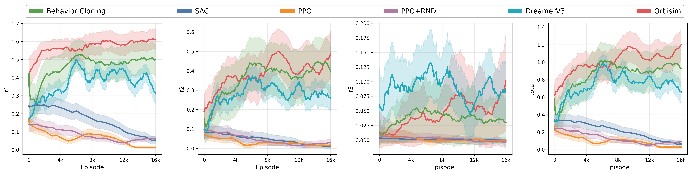
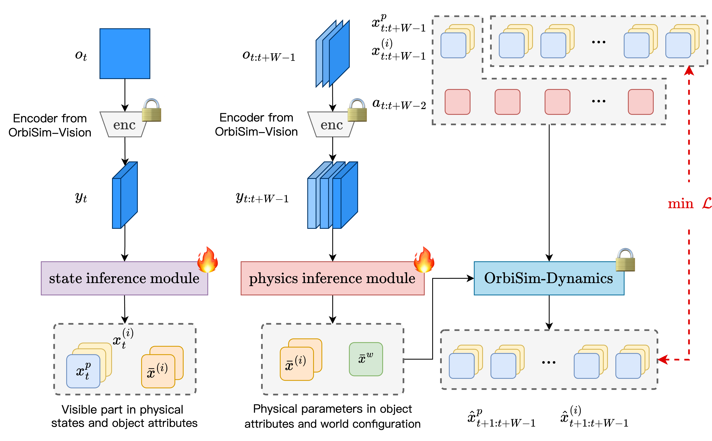
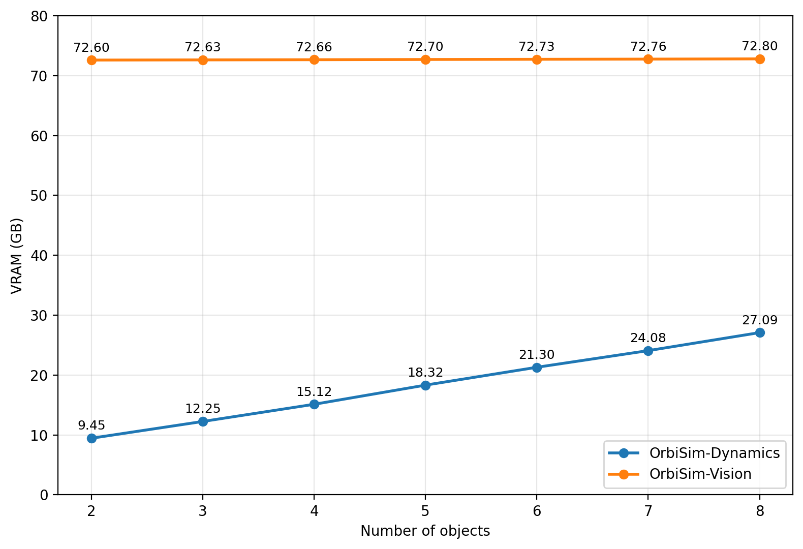

# OrbiSim_append_materials

## 📄 Append Materials (ICML 2026 Submission)

---

## 🔴 Figure 1
## Downstream Policy Performance

BC / SAC / PPO / PPO+Intrinsic / DreamerV3 / **OrbiSim (Dynamics)**  
**Metrics:** r1, r2, r3, total reward, success rate

---

## 🔴 Figure 2
## Model Architecture

State Inference Module + Physics Inference Module

---

## 🔴 Figure 3
## Multi-Task & Multi-Object Generalization

Visualization across diverse tasks and object variations

---

## 🔴 Figure 4
## Memory Scaling

GPU memory usage vs. number of objects

---

## 🔴 Figure 5
## OOD Generalization

Performance in out-of-distribution environments

---

## 🔴 Figure 6
## Point Cloud Experiments

Visualization results with point cloud inputs
